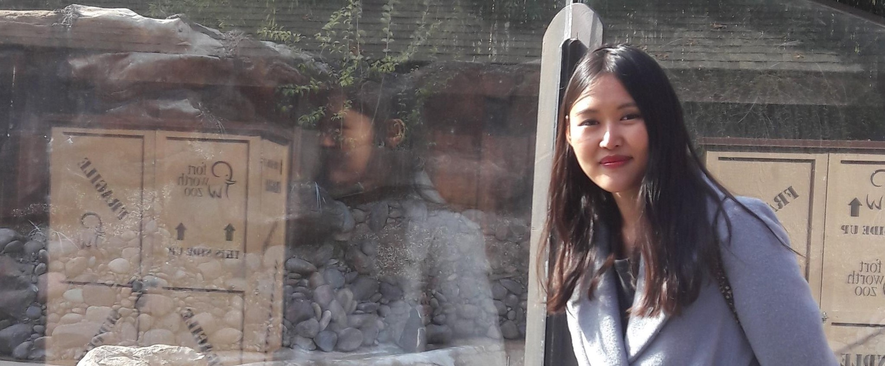

###### (2017 Dec -  in Dallax, TX)
# GIN YOUNG ANDREW 
{: .fs-9 }

{: .fs-6 .fw-300 }

---
<a href="assets/Gin_resume.pdf">[Download Resume]</a>  
## Technical Skills
Java
{: .label .label-yellow}  
Javascript
{: .label }  
, JSP
{: .label }   
JSF
{: .label }  
JSTL
{: .label }  
JDBC
{: .label }  
HTML5
{: .label }  
CSS3
{: .label }  
Bootstrap
{: .label }  
Vue.js
{: .label .label-yellow}  
jQuery
{: .label }  
XML
{: .label }  
JSON
{: .label }  
Spring MVC/Boot
{: .label .label-yellow}   
JPA
{: .label }  
JUnit
{: .label  .label-yellow}  
Mockito
{: .label  .label-yellow}  
H2
{: .label .label-yellow }  
MySQL
{: .label }  
Oracle SQL
{: .label .label-yellow }  
Git
{: .label }  
CVS
{: .label }  
Ant
{: .label }  
Maven
{: .label }  
SOAP 
{: .label }  
Microservices
{: .label .label-yellow }

---
## Work Experience
* **Software Analyst at GE Aviation (in contract) – Cincinnati, OH**	 _(06/2018 to Present)_
	* Debug, fix, and upgrade the intranet applications written in JSF and jBoss and keep production environment operational
	 * Analyze codes of Spring projects including PL/SQL, XML scripts to find the programming defect and data mis-integrity and ensure continuous stable operation of the applications

* **Web Developer at Revature – Reston, VA**  _(01/2018 to 05/2018)_
	* Develop [web applications](https://github.com/1801Jan22Java/team-art/tree/Angular4-Gin) including test codes by using Java, Angular 4, Oracle SQL, and Microservice
	* Contribute as a full stack developer for an optimal REST configurations by practicing SOAP, REST API, WSDL, Service Oriented Architecture (SOA)
	* Construct a testing framework using JUnit to ensure the continous flawless code 

* **Full Stack Developer at Digital One - Seoul, South Korea**  _(03/2016 to 12/2016)_
	* Build the internal scheduler application by using Apache Velocity for [Osstem Implant company ](http://en.osstem.com/main/index.do)
	* Build the point management application [Clip](https://play.google.com/store/apps/details?id=com.kt.android.showtouch&hl=ko) by using [Kakao Geography API](https://apis.map.kakao.com/) , MySQL, and Spring MVC framework
	
* **Site manager at Bomnib - WFH** _(2005 to present)_
	* Maintain [Bomnib](http://m.bomnib.com), a family-owned business owned by my parents. it's built on the e-commerce platform [Cafe24](https://www.cafe24corp.com/en) since 2005. Update the front-end code to make it fit into the mobile devices and implement the user convenient functionalities

---
